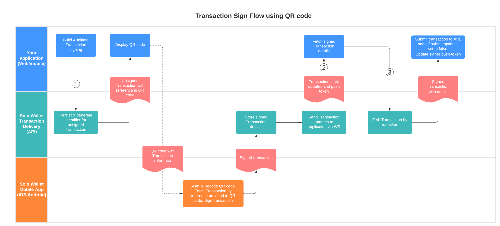
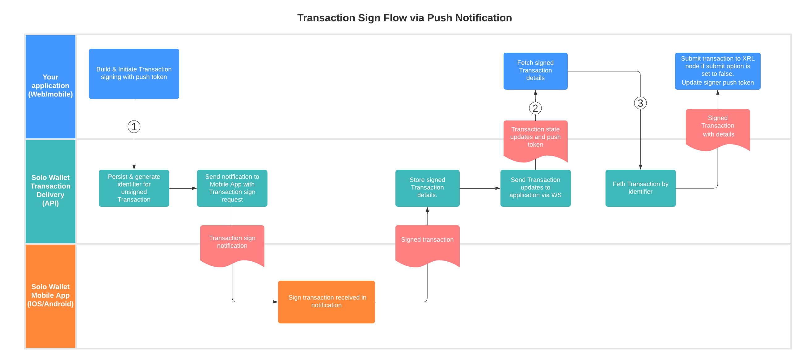
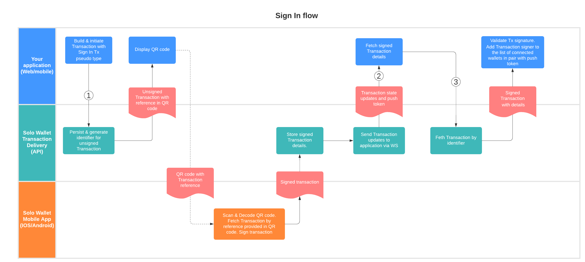

# Solo Wallet Transaction Delivery Workflows

## Glossary

**Tx/XRPL Tx** - refers to XRP Ledger Transaction.
**Transaction** - refers to Sologenic Transaction Delivery Service Transaction which wraps XRP Ledger Transaction.

In the most places where these terms can be used interchangeably term **Transaction** is used. 

## Transaction Sign Flow using QR code



1.[Initiate Transaction API](api.md#Initiate-Transaction)

2.[Listen for Transaction Updates](ws.md#subscribe-to-transaction-updates)

3.[Read Transaction API](api.md#Read-Transaction)

## Transaction Sign Flow via Notification



1.[Initiate Transaction API](api.md#Initiate-Transaction)

**NOTE `options.push_token` parameter is required to send notification**

2.[Listen for Transaction Updates](ws.md#subscribe-to-transaction-updates)

3.[Read Transaction API](api.md#Read-Transaction)

## Sign In Flow



1.[Initiate Transaction API](api.md#Initiate-Transaction)

**NOTE: For signing in use pseudo 'SignIn' transaction type. This transaction will not be published to XRPL**

Pseudo SignIn transaction example:
```json
{
  "tx_json": {
    "TransactionType": "NickNameSet",
    "TransactionKind": "SignIn"
  }
}
```

2.[Listen for Transaction Updates](ws.md#subscribe-to-transaction-updates)

3.[Read Transaction API](api.md#Read-Transaction)
